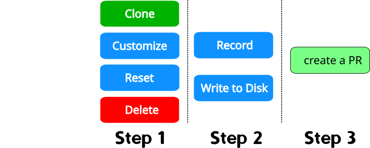

## Flask-based configuration UI

This app aims to provide a graphical interface for customization of **assay_info.jsonconfig** file used by shesmu.
The interface requires flask installation so it can run in a web browser locally. Some settings also
need to be specified, see INSTALL for that.

## Setting up for Development 
 
[Creating Virtual Environment](https://packaging.python.org/en/latest/tutorials/installing-packages/#creating-and-using-virtual-environments)

Launch the virtual environment and install Flask:

```
source venv/bin/activate
pip install -r requirements.txt
```

Configure the application's settings file:

```
cp ui-config.toml.example "${CONFIG_FILE_DIRECTORY}"/ui-config.toml
```

Modify the new file to point to the locations of the shesmu configuration files (currently in
analysis_config).

## Launching the App

Normally, you would update your production branch of the repo with shesmu configuration files 
(olives) and go into your flask-ui directory where
app.py script resides. Before running the app, some environment variables need to be set:

```
 export FLASK_ENV=development
 export UICONFIG_SETTINGS="/home/USERNAME/secrets/ui_config.toml"
```

Assuming that you have your virtual environment configured, you also need to run

```
 source venv/bin/activate
```

To make things easier you may edit the pre_flight.sh
script and start your app with

```
  source pre_flight.sh
```

====================================================

the prompt should change after that. After everything is initialized, type

```
 flask run
```

The message should look similar to this:

```
 INFO: We have 67 .shesmu files for research
 INFO: We have 45 .shesmu files for production-cap
 * Debug mode: off
 * Running on http://127.0.0.1:5000
   Press CTRL+C to quit
```

## Stopping the app

Crl+C on your console is sufficient, flask will stop serving the app at 127.0.0.1:5000
You may also type **deactivate** to terminate the python virtual environment used by flask

## Typical Usage



The UI shows drop-down lists, one for assays, one for versions of selected assay, one for presets
Steps for a session may include some or all of the following:

* Select an assay, review the configuration. Make your selection of parameters and enable
  or disable individual components of computational pipelines
* Reset if not happy with your changes, this will restore configuration from the disk
* Apply a preset if applicable
* Create a configuration for a new assay by cloning, then applying a preset
  or changing individual parameters
* Click Apply, that will update the **assay_staging.jsonconfig** on disk (the path/name is customizable)
* Note that if you check/uncheck some boxes you will need to click Record
  otherwise your changes will be lost if you select another assay
* Go to your local directory with shesmu config files, create a branch, review 
  and commit your changes. Push to the repo and create a Pull Request
* versions for the selected workflows are inserted automatically using the information from a scan of the
  deployed olives at the start. This needs to be checked carefully (may be time-consuming).

## Updates to Presets

The UI app relies on **assay_presets.conf** file which defines a number of settings for
standard pipelines configured by GSI. Occasionally, settings may be removed or added to
the **assay_info.jsonconfig**. flask UI app will not detect and highlight such changes! 
The app takes it's best guess what to use to configure a new 
setting but it always needs to be verified. The proper procedure for this would be to 
use *git diff* followed by manual edits in something like vim or other editor of choice.

------------------------------------------------------------------------------

Developed using Python 3.12, Pycharm IDE v.2023.1 and Flask 3.1.0 
