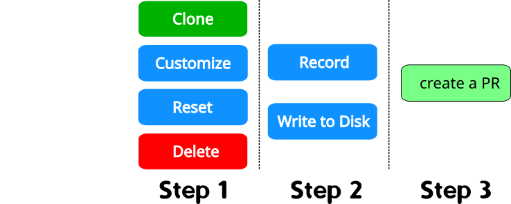

## Flask-based configuration UI

This app aims to provide a graphical interface for customization of **projectconfig** file used by shesmu.
The interface requires flask installation so it can run in a web browser locally. Some settings also
need to be specified, see INSTALL for that. 

[Installing Flask](https://flask.palletsprojects.com/en/2.1.x/installation/)
 
[Creating Virtual Environment](https://packaging.python.org/en/latest/tutorials/installing-packages/#creating-and-using-virtual-environments)

## Launching the App

Normally, you would update your production branch of the repo with shesmu configuration files 
(currently it is spb-seqware-production) and go into your flask-ui directory where
config-ui.py script resides. Before running the app, some environment variables need to be set:

```
 export FLASK_APP=config_ui.py
 export FLASK_ENV=development
 export UICONFIG_SETTINGS="/home/USERNAME/secrets/ui_config.cfg"
```

Assuming that you have your virtual environment configured, you also need to run

```
 source venv/bin/activate
```

To make things easier you may edit the pre_flight.sh
script and start your app with

```
  source pre_flight.sh
```

====================================================

the prompt should change after that. After everything is initialized, type

```
 flask run
```

The message should look similar to this:

```
 * Serving Flask app 'config_ui.py' (lazy loading)
 * Environment: development
 * Debug mode: on
 * Running on http://127.0.0.1:5000/ (Press CTRL+C to quit)
 * Restarting with stat
 * Debugger is active!
 * Debugger PIN: 874-681-120
```

## Stopping the app

Crl+C on your console is sufficient, flask will stop serving the app at 127.0.0.1:5000
You may also type **deactivate** to terminate the python virtual environment used by flask

## Typical Usage



The UI shows a couple of drop-down lists, one for projects and the other one for presets
Steps for a session may include some or all of the following:

* Select a project, review the configuration. Make your selection of parameters and enable
  or disable individual components of computational pipelines
* Reset if not happy with your changes, this will restore configuration from the disk
* Apply a preset if applicable
* Create a configuration for a new project by cloning, then applying a preset
  or changing individual parameters
* Click Apply, that will update the **projectconfig** on disk
* Note that if you check/uncheck some boxes you will need to click Apply
  otherwise your changes will be lost if you select another project
* Go to your local directory with shesmu config files, create a branch, review 
  and commit your changes. Push to the repo and create a Pull Request

------------------------------------------------------------------------------

Developed using Python 3.8, Pycharm IDE v.2020.1 and Flask 2.0.2 
